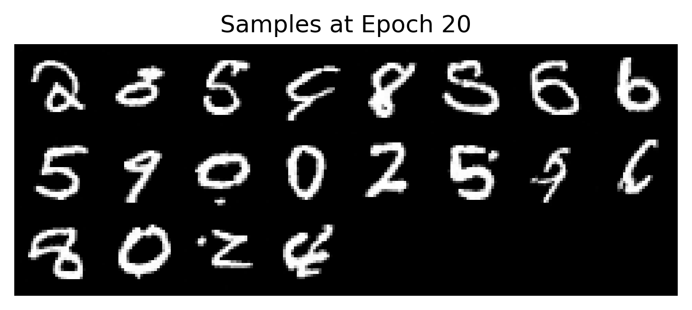
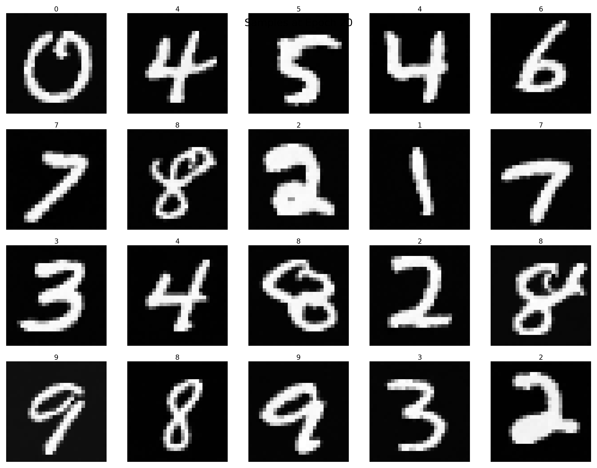
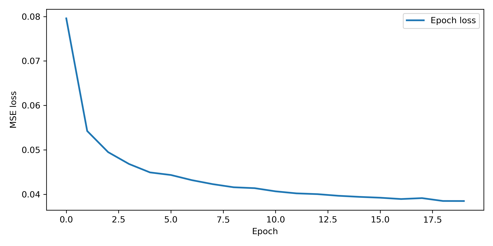
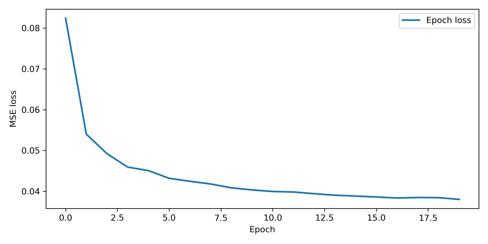

# Diffusion Models on MNIST

## Project Overview
This project implements **Diffusion Probabilistic Models** (DDPMs) in PyTorch to generate MNIST-like handwritten digits. Both unconditional and conditional (class-guided) models are developed for research and educational purposes. This repository was created as part of a neural graphics coursework.

---

## 📚 What are Diffusion Models?
Diffusion Models iteratively remove noise from random images to synthesize highly realistic data, achieving state-of-the-art results in generative modeling. In this project, they are trained to create authentic MNIST-like digits from pure noise! 

---

## 🔥 Generated Samples (after 20 epochs)
<table>
<tr>
<td align="center"><b>Unconditional Model</b> </td>
<td align="center"><b>Conditional Model</b> </td>
</tr>
</table>

---

## 📉 Training Curves
<table><tr>
<td></td>
<td></td>
</tr><tr>
<td align="center"><b>Unconditional Model Loss</b></td>
<td align="center"><b>Conditional Model Loss</b></td>
</tr></table>

---

## 🚦 Quickstart
1. **Clone this repo**  
   `git clone https://github.com/yourname/Diffusion-Model.git`
2. **Install dependencies:**
   - Python 3.8+
   - PyTorch, torchvision, matplotlib, einops, mediapy
   - Recommended: `pip install -r requirements.txt` (see notebooks for any additional commands)
3. **Run the notebook:**
   - `Assignment1_Neural_Graphics.ipynb` – main code & explanation
   - `test_Assignment1_Neural_Graphics.ipynb` – reproducibility & additional experiments

---

## 🧑‍💻 Core Methodology
- **Architecture:** Custom UNet-inspired convolutional backbone
- **Data:** [MNIST](http://yann.lecun.com/exdb/mnist/) handwritten digits
- **Training:** Predict noise at each step, minimizing MSE loss
- **Variants:** Unconditional and classifier-guided (conditional) diffusion

---

## ✨ Highlights & Skills Demonstrated
- **Modern generative modeling** from scratch
- **PyTorch proficiency:** custom modules, dataloaders, training loops
- **Experimentation:** loss curves, hyperparameter exploration
- **Result visualization:** scientific plots, model monitoring
- **Well-structured code and reproducibility** (see included seed controls and testing scripts)

---
